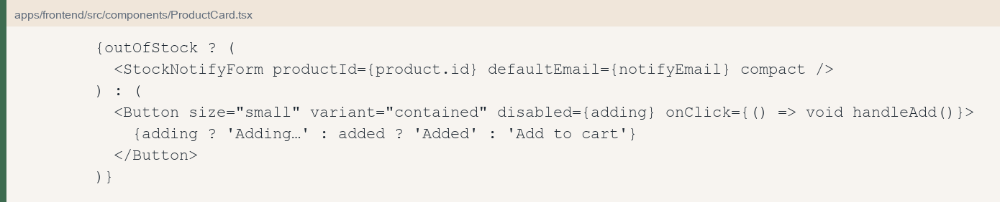
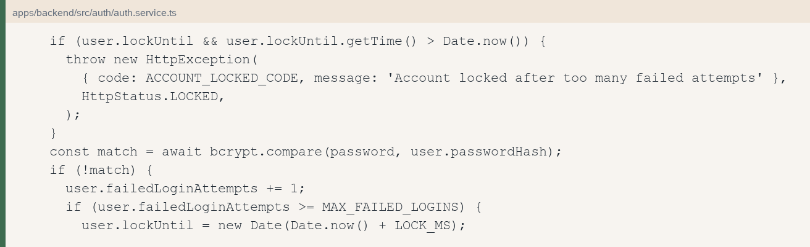
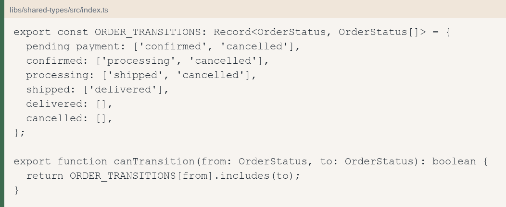

<div dir="rtl">

# מכללת אורט סינגאלובסקי

## מחלקת תוכנה — מסלול טכנאי תוכנה

# ספר פרויקט

# BloomStore

חנות פרחים מקוונת — Full-Stack E-Commerce

מוגשת על ידי

אביב לייסטן · ת״ז 206917353
050-5806570

בהנחיית

מור ברגיג
052-8612379
דרך הטייסים 28, תל אביב

22 בספטמבר 2026

</div>

---

## תוכן עניינים

[פרק 1 — מבוא ותיאור הפרויקט](#ch1)

- [1.1 מטרות המערכת](#ch1-1)
- [1.2 חלוקת תפקידים ומבנה הספר](#ch1-2)

[פרק 2 — ארכיטקטורה ומודל הנתונים](#ch2)

- [2.1 טכנולוגיות](#ch2-1)
- [2.2 מודל הנתונים](#ch2-2)

[פרק 3 — דרישות פונקציונליות](#ch3)

[פרק 4 — צד הלקוח: יסודות הממשק](#ch4)

- [4.1 ממשק החנות — מבט מקדים](#ch4-1)
- [4.2 הקובץ App.tsx וספקי ה־state](#ch4-2)
- [4.3 CatalogPage.tsx — דף הבית](#ch4-3)
- [4.4 ProductCard.tsx — כרטיסיית מוצר](#ch4-4)
- [4.5 עיצוב הפרויקט](#ch4-5)

[פרק 5 — צד השרת: מודול ההזדהות](#ch5)

- [5.1 שלוש השכבות](#ch5-1)
- [5.2 התחברות ונעילת חשבון · POST /api/auth/login](#ch5-2)
- [5.3 אימות Token · GET /api/auth/me](#ch5-3)
- [5.4 שאר מנגנוני המודול](#ch5-4)
- [5.5 החיבור לצד הלקוח](#ch5-5)

[פרק 6 — צד השרת: מודול הניהול](#ch6)

- [6.1 שלוש השכבות](#ch6-1)
- [6.2 אישור וביטול הזמנה](#ch6-2)
- [6.3 שינוי סטטוס הזמנה · PATCH /api/orders/:id/status](#ch6-3)
- [6.4 שאר מנגנוני המודול](#ch6-4)
- [6.5 החיבור לצד הלקוח](#ch6-5)

[פרק 7 — עגלה, תשלום ומחזור חיים של הזמנה](#ch7)

- [7.1 עגלת קניות](#ch7-1)
- [7.2 תשלום](#ch7-2)
- [7.3 מחזור חיים של הזמנה](#ch7-3)

[פרק 8 — אבטחה, API וביצועים](#ch8)

- [8.1 נקודות הקצה](#ch8-1)
- [8.2 ביצועים, אמינות ו־Design Patterns](#ch8-2)

[פרק 9 — תהליך הפיתוח, בדיקות והפצה](#ch9)

- [9.1 תהליך הפיתוח](#ch9-1)
- [9.2 מערך הבדיקות](#ch9-2)
- [9.3 תהליך ההפצה](#ch9-3)

[פרק 10 — סיכום ומסקנות](#ch10)

- [10.1 הישגים טכניים](#ch10-1)
- [10.2 אתגרים ומה שנלמד](#ch10-2)
- [10.3 פיתוחים עתידיים](#ch10-3)
- [10.4 תודות](#ch10-4)

### הצהרת הסטודנטית

אני מצהירה כי העבודה המוגשת להלן נעשתה על ידי באופן עצמאי, על פי ידיעתי האישית, תוך שימוש בקוד, במאמרים ובמקורות אחרים על פי כללי האתיקה האקדמית ובציון מקורות מתאימים. הספר מתאר את BloomStore כפי שהיא בנויה בפרויקט הזה.

---

<a id="ch1"></a>

## פרק 1 — מבוא ותיאור הפרויקט

הפרויקט BloomStore הוא חנות פרחים מקוונת מלאה (Full-Stack E-Commerce), והוא נבנה כפרויקט גמר במסלול טכנאי תוכנה. המערכת מכסה את מסלול הרכישה כולו: עיון בקטלוג ציבורי, הרשמה והתחברות, עגלת קניות, בחירת כתובת משלוח, אישור ההזמנה, ומעקב אחרי סטטוס המשלוח. מנהל החנות מנהל מלאי, מקדם הזמנות וצופה בלוח סטטיסטיקות.

המערכת חיה במונורפו אחד (Nx): אפליקציית React, שרת NestJS, וספריית חוזים משותפת ב־TypeScript. שני הצדדים רצים בנפרד ומתקשרים דרך חוזה API מתועד ב־Swagger.

<a id="ch1-1"></a>

### 1.1 מטרות המערכת

- מערכת מסחר אלקטרוני פונקציונלית מקצה לקצה, מרישום משתמש ועד אישור הזמנה.
- ארכיטקטורת שרת-לקוח מופרדת בתוך מונורפו, עם חוזה טיפוסים אחד ב־`libs/shared-types`.
- אכיפת כל פעולה רגישה בצד השרת, ולא רק הסתרה בצד הלקוח.
- לוח ניהול למוצרים, להזמנות ולתמונת מצב סטטיסטית.
- מלאי עקבי: נעילת מחיר בשורת ההזמנה, והחזרת מלאי בטרנזקציה כשמבטלים לפני משלוח.
- עגלה שנשמרת במסד, כך שהיא נשארת גם אחרי סגירת הדפדפן.
- שפה חזותית אחידה לפי מדריך הסגנון של החנות.

<a id="ch1-2"></a>

### 1.2 חלוקת תפקידים ומבנה הספר

ההגשה היא של סטודנטית יחידה.

| תחום אחריות | מפתחת | רכיב |
| --- | --- | --- |
| ממשק משתמש, ניתוב, ניהול state, מדריך סגנון | אביב לייסטן | `apps/frontend` |
| שרת, מסד נתונים, אימות, הזמנות, אבטחה | אביב לייסטן | `apps/backend` |
| חוזה API, סכמות Zod, מכונת מצבים | אביב לייסטן | `libs/shared-types` |
| ספר הפרויקט והתיעוד | אביב לייסטן | `docs/project-book.md` |

טבלה 1 — חלוקת התפקידים

הספר סוקר את המערכת כולה, ומעמיק בשלושה אזורים שנבחרו להצגה מפורטת: יסודות צד הלקוח (פרק 4), מודול ההזדהות בצד השרת (פרק 5) ומודול הניהול בצד השרת (פרק 6). שאר הפרקים מציגים את היקף המערכת, את מודל הנתונים, את תהליך ההפצה ואת מערך הבדיקות.

---

<a id="ch2"></a>

## פרק 2 — ארכיטקטורה ומודל הנתונים

המערכת BloomStore בנויה על ארכיטקטורת שלוש שכבות: ממשק משתמש, לוגיקה עסקית ומסד נתונים. אותו עיקרון חוזר בתוך השרת. רכיב ה־Controller מחלץ פרמטרים ומחזיר מעטפת `ApiResponse`. הוא אינו ניגש למסד הנתונים. אימות Zod נעשה בקונטרולר בהזדהות, ובשירות בשאר המודולים. רכיב ה־Service מחזיק את כללי המלאי, ההזמנה והאבטחה. רכיב ה־Model של Mongoose הוא שכבת ההתמדה.

<a id="ch2-1"></a>

### 2.1 טכנולוגיות

| שכבה | טכנולוגיה | לשם מה |
| --- | --- | --- |
| מונורפו | Nx · TypeScript במצב strict · Node 20+ | פרויקט אחד לשלוש חבילות, בנייה ובדיקות דרך `npx nx` |
| צד לקוח | React 19 ו־TypeScript | רכיבים לשימוש חוזר וטיפוסים משותפים עם השרת |
| צד לקוח | Vite ו־React Router 7 | שרת פיתוח ומעבר בין דפים בלי רענון |
| צד לקוח | Axios | צירוף אוטומטי של ה־JWT לכל בקשה |
| צד לקוח | MUI 7 | ספריית רכיבי הממשק |
| צד לקוח | הנחיות עיצוב | כללי צבע, גופן ומבנה מסך בפרויקט |
| צד לקוח | Recharts | תרשים מכירות בלוח הניהול |
| צד שרת | NestJS 11 על Express | מודולים והרשאות גישה |
| צד שרת | MongoDB ו־Mongoose | מסמכי הזמנה, סכמה ואינדקסים |
| צד שרת | מטמון בזיכרון התהליך | עותק קצר של העגלה. MongoDB נשאר מקור האמת |
| צד שרת | Zod · Helmet · CORS | בדיקת קלט, כותרות אבטחה ומקורות מורשים |
| צד שרת | bcryptjs · @nestjs/jwt | גיבוב סיסמאות והנפקת טוקן גישה |
| צד שרת | Swagger | תיעוד חי של ה־API ב־`/api/swagger` |
| נתונים | MongoDB Atlas | אשכול עם העתקים, נדרש לטרנזקציית הביטול |
| הפצה | GitHub Actions · GitHub Pages · Render | בדיקות אוטומטיות, אתר החנות, וה־API בקונטיינר |

טבלה 2 — הטכנולוגיות שנבחרו והתפקיד של כל אחת

אחרי שמירת הכתובת הלקוח מאשר את ההזמנה. אין בממשק מסך להזנת פרטי אשראי, ומספר כרטיס אינו נאסף. במסד נרשם מסמך תשלום בסטטוס `pending`, בלי פרטי כרטיס. קולקציות ה־webhook קיימות לקליטת אירוע תשלום עתידי בלי לעבד אותו פעמיים.

<a id="ch2-2"></a>

### 2.2 מודל הנתונים

הנתונים מאורגנים באחת-עשרה קולקציות: שש קולקציות ליבה עסקית וחמש קולקציות תמיכה ותשתית.

| קולקציה | תפקיד | שדות מרכזיים |
| --- | --- | --- |
| `users` | חשבון, הרשאות ואבטחה | `email`, `passwordHash`, `fullName`, `role`, `tokenVersion`, `failedLoginAttempts`, `lockUntil` |
| `products` | קטלוג | `name`, `description`, `category`, `price`, `stock`, `imageUrl`, `isActive`, `stockNotifyEmails` |
| `carts` | עגלה אחת לכל משתמש (1:1) | `userId` ייחודי, `items[{productId, quantity}]` |
| `orders` | הזמנה עם Snapshot של הרכישה | `orderNumber`, `userId`, `status`, `items[]`, `total`, `addressId` |
| `payments` | רישום סכום ההזמנה, בלי ניסיון תשלום | `orderId`, `userId`, `amount`, `status` |
| `addresses` | פנקס כתובות משלוח | `userId`, `fullName`, `phone`, `city`, `street`, `houseNumber`, `isDefault` |
| `sequences` | מונה אטומי למספרי הזמנה | `name`, `value` (ה־seed מתחיל את המונה ב־1000; מספר ההזמנה הוא `BLM-n`) |
| `auditlogs` | יומן ביקורת | `actorId`, `action`, `entity`, `entityId`, `metadata` |
| `webhookevents` | אירוע תשלום שכבר נקלט | `eventId` ייחודי, `type`, `payload`, `status` |
| `failedwebhooks` | אירוע שנכשל בקליטה | `eventId`, `type`, `reason`, `payload` |
| `idempotencykeys` | מניעת הזמנה כפולה | `key`, `userId`, `orderId`, תפוגה אחרי 24 שעות |

טבלה 3 — אחת-עשרה הקולקציות במסד הנתונים

יחסים: משתמש אחד לרבות כתובות והזמנות, משתמש אחד לעגלה אחת, הזמנה אחת למסמך סכום אחד. שורות ההזמנה שומרות עותק של שם המוצר ושל המחיר. הן אינן תלויות במחיר החי בקטלוג אחרי יצירת ההזמנה.

אינדקס הקטלוג הוא על `isActive`, `stock` ו־`category`. מוצר עם `isActive: false` נעלם מהקטלוג הציבורי. מוצר עם `stock === 0` נשאר גלוי, עם הרשמה להתראת מלאי, והעגלה עדיין דוחה אותו.

---

<a id="ch3"></a>

## פרק 3 — דרישות פונקציונליות

המערכת כוללת אחד-עשר מסכים בשלושה אזורים: אזור ציבורי, אזור למשתמש מחובר, ולוח ניהול.

| מסך | תיאור | פונקציות מרכזיות |
| --- | --- | --- |
| דף הבית | קטלוג המוצרים הפעילים | שליפה מהשרת, סינון קטגוריה, גריד, מוצרים שאזלו נשארים עם התגית Out of stock וטופס Email me |
| דף מוצר | פרטי פריט בודד | תמונה, מחיר, מלאי, הוספה לעגלה או טופס התראת מלאי |
| יצירת קשר | `/contact` | פרטי החנות וטופס פנייה |
| התחברות | כניסת משתמש קיים | ולידציית שדות, שמירת Token, הודעת נעילה ב-423 |
| הרשמה | יצירת חשבון לקוח | ולידציה, יצירת משתמש, כניסה אוטומטית |
| עגלת קניות | פריטים לפני תשלום | שינוי כמות, הסרת פריט, מעבר לקופה |
| קופה | כתובת ויצירת הזמנה | בחירה או יצירה של כתובת, מפתח idempotency, סטטוס `pending_payment` |
| ההזמנות שלי | מעקב הלקוח | מספר הזמנה, מחיר נעול, סטטוס, ביטול לפני משלוח |
| ניהול — מוצרים | קטלוג כולל לא-פעילים | הוספה, סימון אזל, החזרה למלאי, מחיקה רכה |
| ניהול — הזמנות | מעקב מנהל | סינון לפי סטטוס וקידום לפי מכונת המצבים |
| ניהול — סטטיסטיקות | תמונת מצב | הכנסות, הזמנות פתוחות, מלאי נמוך, צמיחת משתמשים ותרשים שבועי |

טבלה 4 — אחד-עשר מסכי המערכת והפונקציות שבכל אחד

דרישות לא פונקציונליות: TypeScript strict בכל הפרויקטים, מעטפת JSON אחידה `{ success, data }` או `{ success: false, error }`, ותיעוד חי של הספר ושל ה־API.

---

<a id="ch4"></a>

## פרק 4 — צד הלקוח: יסודות הממשק

פרק זה נפתח במבט על הממשק שהלקוח רואה, ואחריו מציג את מעטפת האפליקציה, את דף הקטלוג ואת כרטיסיית המוצר. עיצוב הפרויקט סוגר את הפרק.

<a id="ch4-1"></a>

### 4.1 ממשק החנות — מבט מקדים

דף הבית הוא נקודת הכניסה. המסגרת קבועה, והרשת שמתחתיה משתנה לפי מלאי.

| אזור | מה מוצג | כלל |
| --- | --- | --- |
| מסגרת | `Header`, תוכן, `Footer` | ניהול רק בתפריט החשבון, ורק ל־`admin` |
| ראש העמוד | `CatalogHero` | קריאה לפעולה Shop Flowers |
| סינון | `CategoryPills` | כפתורי קטגוריה מעל הרשת |
| כרטיס | תמונה, שם, מחיר, פעולה | המחיר בשקלים |
| אזל מהמלאי | תגית מלאי וטופס דוא״ל | הפריט נשאר על המדף |
| לא פעיל | אינו מוצג | השרת לא שולח את המוצר |

טבלה 5 — מבנה הממשק בדף הבית

<a id="ch4-2"></a>

### 4.2 הקובץ App.tsx וספקי ה־state

הקובץ `main.tsx` מרכיב את העץ: `ThemeProvider` ו־`CssBaseline` לפי ערכת הנושא, `BrowserRouter` עם בסיס הנתיב של GitHub Pages, ואז `AuthProvider` ו־`CartProvider`. שני המצבים הגדולים — המשתמש המחובר והעגלה — יושבים ב־Context ולא בתוך `App.tsx`. כך כל דף קורא ל־`useAuth` או ל־`useCart` בלי להעביר props לאורך כל העץ.

הקובץ `App.tsx` אחראי על ארבעה דברים: גלילה לראש בכל ניווט, הצגת Header ו־Footer, הגדרת הנתיבים, ושערי גישה. `Private` מפנה ל־`/login` כשאין משתמש. `AdminOnly` מפנה לדף הבית כשהתפקיד אינו `admin`. השער בצד הלקוח הוא חוויית משתמש. האכיפה נשארת בשרת.

הספק `AuthProvider` בודק בעליית האפליקציה אם יש `bloomstore.token` ב־`localStorage`. אם יש, הוא קורא ל־`GET /api/auth/me`. תשובה תקינה שומרת את המשתמש. כשל מוחק את הטוקן. התחברות והרשמה שומרות את ה־Token שחזר מהשרת. התנתקות קוראת ל־`POST /api/auth/logout` ומוחקת את המפתח המקומי.

הספק `CartProvider` שולף את העגלה מ־`GET /api/cart` בכל פעם שיש משתמש מחובר. בלי משתמש העגלה המקומית מתרוקנת. הוספה, עדכון והסרה מעדכנים את ה־state לפי תשובת השרת.

לקוח ה־Axios ב־`services/api.ts` מצמיד `Authorization: Bearer` לכל בקשה שיש לה טוקן, ופורש את המעטפת `{ success, data }`.

<a id="ch4-3"></a>

### 4.3 CatalogPage.tsx — דף הבית

הדף `CatalogPage` אחראי על שליפת המוצרים, על שמירתם ב־state, על סינון לפי קטגוריה מתוך ה־query string, ועל הצגה באמצעות `ProductCard`. בזמן טעינה מוצגים שישה שלדי כרטיס (`ProductCardSkeleton`). רשימה ריקה מציגה `EmptyState`.

הקטגוריה נקראת מ־`?category=`. ערך שאינו בקבוצת הקטגוריות החוקית מתעלמים ממנו. הבקשה היא `GET /api/products` או `GET /api/products?category=`. השרת כבר מסתיר מוצרים לא פעילים וממיין פריטים במלאי לפני פריטים שאזלו. הדף אינו מסנן לבד מוצרים עם מלאי אפס, כדי שהלקוח יוכל להירשם להתראה.

הוספה לעגלה בודקת קודם אם יש משתמש. אורח מועבר ל־`/login` עם כתובת החזרה. משתמש מחובר קורא ל־`add` של ה־Context.

<a id="ch4-4"></a>

### 4.4 ProductCard.tsx — כרטיסיית מוצר

הכרטיס `ProductCard` מציג מוצר אחד: תמונה, שם, מחיר, ומצב מלאי. הוא מקבל את המוצר ואת `onAddToCart`. לחיצה על התמונה או על השם מובילה ל־`/products/:id`.

כשהמלאי אפס, במקום כפתור הוספה מופיע טופס התראת דוא״ל. בין יחידה אחת לשלוש מופיעה תגית של מלאי נמוך. בזמן ההוספה הכפתור ממתין, ואחרי הצלחה יש אישור קצר. שגיאה מהשרת, למשל כמות גדולה מהמלאי, נשארת על הכרטיס.



איור 1 — הכרטיס ב־ProductCard כשהמלאי אזל

בריחוף עם עכבר הכרטיס עולה מעט ומקבל צל רך. במסך מגע אין את האפקט הזה.

<a id="ch4-5"></a>

### 4.5 עיצוב הפרויקט

העיצוב חשוב מאוד, כי זה הדבר הראשון שרואים כשנכנסים לחנות. האתר מרגיש נקי ומסודר, ומגוון צבעי הפרחים יכול להופיע בלי שהעין תתעייף. הרקע קרם, הכרטיסים בהירים ורכים, הכפתור הראשי בורד מאובק, וההדגשות בירוק מרווה. הטקסט נשאר כהה וקריא, כדי שהצבע יישאר בתמונות ולא יתפזר על כל העמוד. הכותרות ב־Fraunces, גופן רך עם קצת אופי, והטקסט השוטף ב־DM Sans.

המסכים בנויים מרכיבי MUI, וכל עמוד עטוף ב־`PageShell`. הכפתורים לא כתובים באותיות גדולות, הפינות מעוגלות, והצל על הכרטיס עדין. לא נוסף צבע חדש בכל מסך. כל הערכים יושבים במקום אחד, ב־`src/theme/tokens.ts`, לפי `STYLE_GUIDE.md`. Tailwind נשאר רק בקוד ישן.

---

<a id="ch5"></a>

## פרק 5 — צד השרת: מודול ההזדהות

פרק זה מציג את מודול ההזדהות: תחילה את שלוש השכבות, ואחר כך שתי נקודות קצה במלואן.

<a id="ch5-1"></a>

### 5.1 שלוש השכבות

ב־NestJS אין קובץ ראוטר נפרד. הנתיבים וה־Guards יושבים על הקונטרולר. השירות אינו מכיר את אובייקט ה־HTTP.

| שכבה | קובץ | אחריות |
| --- | --- | --- |
| Controller | `auth/auth.controller.ts` | ארבע נקודות קצה: register, login, logout, me |
| Service | `auth/auth.service.ts` | הרשמה, התחברות, נעילה, הנפקת JWT |
| Model | `models/user.schema.ts` | סכמת המשתמש |
| Guard | `auth/jwt.strategy.ts` | פענוח ה־Token מתוך כותרת Authorization |
| Guard | `auth/token-version.guard.ts` | השוואת `tokenVersion` מול המסד |
| Rate limit | `main.ts` | עד 20 ניסיונות לדקה מאותה כתובת IP על login, register והתראת מלאי |

טבלה 6 — חלוקת האחריות במודול ההזדהות

נתיבי `register` ו־`login` ציבוריים. נתיבי `logout` ו־`me` דורשים `AuthGuard('jwt')` ואחריו `TokenVersionGuard`.

<a id="ch5-2"></a>

### 5.2 התחברות ונעילת חשבון · POST /api/auth/login

הקונטרולר מאמת את הגוף מול `loginSchema` ומעביר אימייל וסיסמה לשירות.

בשירות ארבעה כללים:

1. המשתמש נשלף לפי אימייל באותיות קטנות. אימייל שאינו קיים וסיסמה שגויה מחזירים אותה שגיאה: `INVALID_CREDENTIALS` עם HTTP 401.
2. אם `lockUntil` עדיין בעתיד, הבקשה נדחית לפני השוואת הסיסמה, עם HTTP 423 והקוד `ACCOUNT_LOCKED`.
3. כל כישלון מגדיל את `failedLoginAttempts`. בכישלון החמישי (`MAX_FAILED_LOGINS`) נקבע `lockUntil` לעוד 15 דקות, נרשמת פעולת `user.lockout` ביומן, ומוחזר 423.
4. התחברות מוצלחת מאפסת את המונה ואת הנעילה, רושמת `user.login`, ומנפיקה JWT.



איור 2 — הנעילה ב־AuthService.login

הסיסמה נשמרת רק כ־hash של bcrypt בעשרה סבבי salt. ההשוואה היא `bcrypt.compare` מול ה־hash.

הרשמה של כתובת קיימת מחזירה 409 עם `EMAIL_TAKEN`. תשובת 423 על חשבון נעול מעידה שהחשבון קיים. זו הגנה חלקית ומודעת: הסתרה מלאה הייתה דורשת תשובה אחידה גם בהרשמה, במחיר בהירות למשתמש שנרשם.

<a id="ch5-3"></a>

### 5.3 אימות Token · GET /api/auth/me

זו נקודת הקצה שה־`useEffect` של `AuthProvider` קורא לה בכל עליית אפליקציה, אם נשמר Token.

ה־JWT נחתם עם `sub`, `email`, `role` ו־`tokenVersion`. תוקף ברירת המחדל הוא שמונה שעות (`JWT_EXPIRES_IN`). `TokenVersionGuard` טוען את המשתמש מהמסד ומשווה את הגרסה החתומה לגרסה השמורה. אי-התאמה מחזירה 401 עם `TOKEN_REVOKED`.

התנתקות מגדילה את `tokenVersion` באחד. כל Token שכבר הונפק נפסל בלי רשימה שחורה. שינוי הסיסמה אינו ממומש כמסלול נפרד. פסילת הסשן הקיים נעשית באותו שדה.

<a id="ch5-4"></a>

### 5.4 שאר מנגנוני המודול

כל נתיב מוגן נבדק קודם ב־JWT ואז ב־`tokenVersion`, והקונטרולר מקבל משתמש שכבר אומת. הסיסמה נשמרת רק כ־hash. שגיאות חוזרות כ־`{ success: false, error }`, והרשמה, התחברות, נעילה והתנתקות נרשמות ב־`auditlogs`.

<a id="ch5-5"></a>

### 5.5 החיבור לצד הלקוח

הדפים `LoginPage` ו־`RegisterPage` שולחים את הטופס לנקודות הקצה, ו־`AuthProvider` שומר את ה־Token ומעדכן את המשתמש. מסך ההתחברות מציג את הודעת הנעילה כשהשרת מחזיר 423. אחרי הצלחה המשתמש חוזר לכתובת שממנה הופנה, או לדף הבית.

---

<a id="ch6"></a>

## פרק 6 — צד השרת: מודול הניהול

אין בשרת מודול בשם `admin` שמכיל את כל פעולות הניהול. ההגנה משותפת: `AuthGuard`, `TokenVersionGuard` ו־`AdminGuard`. הפעולות עצמן יושבות על מוצרים, על הזמנות ועל אנליטיקה. בצד הלקוח הן מתכנסות למסך אחד.

<a id="ch6-1"></a>

### 6.1 שלוש השכבות

רכיב ה־`AdminGuard` בודק `req.user.role === 'admin'` ומחזיר 403 עם `FORBIDDEN` לכל תפקיד אחר. הוא רץ אחרי שה־Token אומת, כי הוא תלוי ב־payload שכבר הוצמד לבקשה.

| שכבה | קובץ | אחריות |
| --- | --- | --- |
| Controller | `products/products.controller.ts` | רשימת מנהל, יצירה, עדכון, מחיקה רכה |
| Controller | `orders/orders.controller.ts` | רשימת הזמנות, שינוי סטטוס, ביטול |
| Controller | `analytics/analytics.controller.ts` | `GET /api/admin/stats` |
| Service | `products.service.ts` | קטלוג, Soft Delete, התראת מלאי |
| Service | `orders.service.ts` | מכונת מצבים ו־restock |
| Service | `analytics.service.ts` | שש שאילתות במקביל |
| Guard | `auth/admin.guard.ts` | דחיית משתמש שאינו מנהל |
| Audit | `audit/audit.service.ts` | רישום פעולות יצירה, עדכון, מחיקה ושינוי סטטוס |

טבלה 7 — חלוקת האחריות במודול הניהול

<a id="ch6-2"></a>

### 6.2 אישור וביטול הזמנה

המנהל רואה את ההזמנות ויכול לאשר אותן או לבטל אותן לפני המשלוח. אישור מעביר את ההזמנה ל־`confirmed`. ביטול מעביר אותה ל־`cancelled` ומחזיר את המלאי. אחרי שההזמנה יצאה למשלוח אי אפשר לבטל אותה.

<a id="ch6-3"></a>

### 6.3 שינוי סטטוס הזמנה · PATCH /api/orders/:id/status

זו הפעולה הרגישה בלוח הניהול, כי היא משנה את סטטוס ההזמנה ואת מסמך התשלום. הקונטרולר מוגן ב־`AdminGuard`, מחלץ את מזהה ההזמנה ואת גוף הבקשה, וקורא ל־`OrdersService.updateStatus`.

בשירות שתי בדיקות לפני כל כתיבה. הראשונה מוודאת שהסטטוס המבוקש הוא ערך מתוך `ORDER_STATUSES`. השנייה קוראת ל־`canTransition`. מעבר שאינו במטריצה נדחה עם `ILLEGAL_TRANSITION`.

המעברים החוקיים:

| מ | אל |
| --- | --- |
| `pending_payment` | `confirmed`, `cancelled` |
| `confirmed` | `processing`, `cancelled` |
| `processing` | `shipped`, `cancelled` |
| `shipped` | `delivered` |
| `delivered` | אין |
| `cancelled` | אין |

טבלה 8 — מטריצת מעברי ההזמנה

מעבר ל־`confirmed` מסמן את התשלום כ־`captured`. מעבר ל־`cancelled` מפעיל החזרת מלאי בטרנזקציה ומסמן את התשלום כ־`refunded`. אחרי משלוח אי אפשר לבטל דרך המטריצה, והשירות חוסם restock גם אם הסטטוס כבר `shipped`, `delivered` או `cancelled`.

<a id="ch6-4"></a>

### 6.4 שאר מנגנוני המודול

- **בדיקת ההרשאה.** הקישור לניהול מוצג רק למנהל. פנייה ישירה ל־`/api/products/admin` או ל־`/api/orders/admin` עם Token של לקוח נענית ב-403.
- **Soft Delete.** `DELETE /api/products/:id` אינו מוחק את המסמך. הוא קובע `isActive: false`. הזמנות ישנות שומרות את שם המוצר ואת מחירו ב־snapshot, והמוצר נעלם מהקטלוג הציבורי.
- **החזרה למלאי.** עדכון שמעלה `stock` מאפס ליחידה חיובית שולח התראת דוא״ל לכל כתובת ב־`stockNotifyEmails` ומרוקן את הרשימה. בלי `MAIL_WEBHOOK_URL` ההודעה נכתבת ללוג השרת.
- **Audit Log.** יצירת מוצר, עדכון, מחיקה רכה ושינוי סטטוס נרשמים עם מזהה המנהל והמשאב.
- **סינון הזמנות.** `GET /api/orders/admin?status=` מחזיר את כל ההזמנות או רק סטטוס אחד.

<a id="ch6-5"></a>

### 6.5 החיבור לצד הלקוח

מסך ה־`AdminPage` מחזיק שלושה טאבים ב־state מקומי: Products, Orders, Statistics. כל טאב קורא לנקודת הקצה המתאימה. טופס הוספת המוצר רץ מול אותה סכמת Zod שבשרת, כדי להציג שגיאות שדה לפני השליחה. תרשים העמודות של Recharts מצייר את `salesByDay`.

---

<a id="ch7"></a>

## פרק 7 — עגלה, תשלום ומחזור חיים של הזמנה

<a id="ch7-1"></a>

### 7.1 עגלת קניות

העגלה נשמרת במסד הנתונים, לא בדפדפן. סגירת הדפדפן או מעבר מכשיר אינם מוחקים אותה, כל עוד המשתמש מחובר לאותו חשבון.

- **שמירה כפולה.** כל שינוי נכתב קודם ב־MongoDB, ואחר כך לעותק קצר בזיכרון השרת. המפתח הוא `cart:{userId}`, והעותק נשמר כחמש דקות. אם העותק לא זמין, הקריאה חוזרת למסד והעגלה לא הולכת לאיבוד.
- **בדיקת מלאי בהוספה.** המוצר חייב להיות פעיל ובעל `stock > 0`, והכמות אינה יכולה לעבור את המלאי. אחרת חוזר `OUT_OF_STOCK` או `NOT_FOUND`.
- **יחס 1:1.** אינדקס ייחודי על `userId`.
- **מחיר לתצוגה.** בעת טעינת העגלה השירות מצרף שם, תמונה ומחיר עדכני מהקטלוג. נעילת המחיר מתרחשת רק ביצירת ההזמנה.

<a id="ch7-2"></a>

### 7.2 תשלום

הקופה (`CheckoutPage`) עוברת משלושה שלבים בממשק אחד: סיכום העגלה, בחירה או יצירה של כתובת, ושליחת `POST /api/orders/checkout` עם `addressId` ו־`idempotencyKey`. אחרי הכתובת מופיע כפתור Place order. אין מסך להזנת פרטי אשראי, והסכום הוא סכום שורות ה־snapshot.

יצירת ההזמנה רצה בטרנזקציית MongoDB:

1. אם אותו מפתח idempotency כבר מצביע על הזמנה של אותו משתמש, מוחזרת ההזמנה הקיימת ולא נוצרת שנייה.
2. הכתובת חייבת להיות בבעלות המשתמש.
3. לכל שורה מתבצע `findOneAndUpdate` שמצליח רק אם המוצר פעיל והמלאי מספיק, ומפחית את המלאי באותה פעולה.
4. נוצרת הזמנה בסטטוס `pending_payment` עם מספר `BLM-n`, שורות snapshot וסכום.
5. נוצר תשלום `pending` על אותו סכום.
6. העגלה במסד מתרוקנת, ואז גם עותק ה־Cache.

כישלון באמצע הטרנזקציה מחזיר את המלאי ואת העגלה לאחור. לחיצה כפולה על יצירת ההזמנה נעצרת במפתח ה־idempotency, שנשמר 24 שעות.

קליטת webhook ב־`POST /api/webhooks/payments` שומרת אירוע לפי `eventId`. אירוע שכבר נראה מוחזר בלי כתיבה שנייה. כשל בשמירה נרשם ב־`failedwebhooks`. המסלול הזה אינו מאשר הזמנה ואינו מפחית מלאי. אישור ההזמנה הוא מעבר המנהל ל־`confirmed`.

<a id="ch7-3"></a>

### 7.3 מחזור חיים של הזמנה

סטטוס ההזמנה הוא enum בן שישה ערכים, והמעברים הם אלו שבטבלה 8. מספר ההזמנה מגיע ממונה אטומי בקולקציית `sequences`.



איור 3 — מטריצת המעברים ב־shared-types

פריטי ההזמנה נשמרים כ־snapshot: `productId`, `name`, `imageUrl`, `unitPrice`, `quantity`. שינוי מחיר בקטלוג אחרי הקופה אינו משנה הזמנה שכבר נוצרה.

ביטול אפשרי מ־`pending_payment`, מ־`confirmed` ומ־`processing`. הלקוח קורא ל־`POST /api/orders/:id/cancel`. המנהל יכול גם לבטל דרך שינוי הסטטוס. המלאי כבר ירד בקופה, ולכן הביטול מחזיר לכל שורה את הכמות שנשמרה ב־snapshot, בתוך טרנזקציה, ומסמן את התשלום כ־`refunded`. אם מוצר היה באפס מלאי לפני ההחזרה, נשלחת התראת חזרה למלאי.

מ־`shipped` המעבר היחיד הוא אל `delivered`. אין החזרת מלאי אחרי יציאה למשלוח.

---

<a id="ch8"></a>

## פרק 8 — אבטחה, API וביצועים

<a id="ch8-1"></a>

### 8.1 נקודות הקצה

הבסיס המקומי הוא `http://localhost:3030/api`.

| פעולה | נתיב | תיאור |
| --- | --- | --- |
| POST | `/api/auth/register` | יצירת לקוח |
| POST | `/api/auth/login` | התחברות |
| POST | `/api/auth/logout` | התנתקות |
| GET | `/api/auth/me` | המשתמש המחובר |
| GET | `/api/products` | קטלוג |
| GET | `/api/products/:id` | פרטי מוצר |
| POST | `/api/products/:id/stock-alerts` | התראת מלאי |
| GET | `/api/products/admin` | כל המוצרים |
| POST | `/api/products` | יצירת מוצר |
| PATCH | `/api/products/:id` | עדכון מוצר |
| DELETE | `/api/products/:id` | מחיקה רכה |
| GET | `/api/cart` | שליפת עגלה |
| PUT | `/api/cart/items` | עדכון פריט |
| DELETE | `/api/cart/items/:productId` | הסרת פריט |
| GET | `/api/addresses` | רשימת כתובות |
| POST | `/api/addresses` | יצירת כתובת |
| POST | `/api/orders/checkout` | יצירת הזמנה |
| GET | `/api/orders/mine` | ההזמנות שלי |
| GET | `/api/orders/:id` | פרטי הזמנה |
| POST | `/api/orders/:id/cancel` | ביטול הזמנה |
| GET | `/api/orders/admin` | כל ההזמנות |
| PATCH | `/api/orders/:id/status` | שינוי סטטוס |
| GET | `/api/admin/stats` | לוח בקרה |
| POST | `/api/webhooks/payments` | אירוע תשלום |
| GET | `/api/health` | בדיקת חיות |
| GET | `/api/docs` | ספר הפרויקט |
| GET | `/api/docs/readme` | מדריך ה־API |

טבלה 9 — נקודות הקצה

<a id="ch8-2"></a>

### 8.2 ביצועים, אמינות ו־Design Patterns

- **מקור אמת יחיד לעגלה.** MongoDB שומר את העגלה. העותק בזיכרון רק מקצר קריאה חוזרת.
- **שאילתות דשבורד במקביל.** `Promise.all` במקום שרשרת שמחברת זמני תגובה.
- **אינדקס קטלוג.** `isActive`, `stock`, `category`.
- **טרנזקציה.** קופה וביטול רצים על replica set. בלי זה אי אפשר להחזיר מלאי וסטטוס יחד.
- **Idempotency.** מפתח הקופה נשמר 24 שעות ומונע הזמנה כפולה ברשת לא יציבה.

| Pattern | היכן במערכת | לאיזה צורך |
| --- | --- | --- |
| Layered Architecture | Controller ← Service ← Model | בדיקת הלוגיקה בלי HTTP |
| Envelope | `common/http.ts` | תשובות אחידות ללקוח |
| Price Snapshot | `orders.service.ts` | נעילת מחיר ושם בשורת ההזמנה |
| Write-Through Cache | `carts.service.ts` + `cache.service.ts` | קריאה מהירה בלי לוותר על המסד |
| State Machine | `canTransition` ב־shared-types | מעברי סטטוס חוקיים בלבד |
| Token Versioning | `User.tokenVersion` + `TokenVersionGuard` | פסילת JWT בהתנתקות |
| Account Lockout | `AuthService.login` | חמישה כישלונות, ואז 423 ל-15 דקות |
| Idempotency | `idempotencykeys` | מניעת הזמנה כפולה |
| Soft Delete | `Product.isActive` | הסתרה מהקטלוג בלי לשבור היסטוריה |
| Middleware Chain | Helmet, CORS, rate limit, sanitize | שכבות אבטחה בסדר קבוע |

טבלה 10 — דפוסי העיצוב ומקום היישום

---

<a id="ch9"></a>

## פרק 9 — תהליך הפיתוח, בדיקות והפצה

<a id="ch9-1"></a>

### 9.1 תהליך הפיתוח

שלושת הפרויקטים חיים בריפו אחד. החוזה הוגדר קודם ב־`libs/shared-types`: סכמות Zod, סטטוסים, ומטריצת המעברים. השרת והלקוח מייבאים את אותם טיפוסים, ו־Swagger משקף את הנתיבים.

פקודות העבודה, תמיד דרך Nx המקומי:

- `npm run dev` — שרת על פורט 3030 וחנות על פורט 3000.
- `npx nx run-many` ל־build, lint, test ו־typecheck של frontend, backend ו־shared-types.

בהפעלה אפשר להוסיף חשבון מנהל אחד ושני חשבונות לקוח. הם נוצרים כשמוגדרים גם האימייל וגם הסיסמה.

| תפקיד | אימייל | סיסמה |
| --- | --- | --- |
| מנהל | `avivedri3@gmail.com` | `AvivAdmin2026!` |
| לקוח | `demo.maya@bloomstore.com` | `DemoMaya2026!` |
| לקוח | `demo.alex@bloomstore.com` | `DemoAlex2026!` |

טבלה 11 — חשבון מנהל ושני חשבונות לקוח

<a id="ch9-2"></a>

### 9.2 מערך הבדיקות

בדיקות היחידה שרצות ב־CI מכסות את מכונת המצבים (`libs/shared-types`), את מעטפת ה־HTTP ואת מדיניות הנעילה (`apps/backend/src/common/http.spec.ts`), ואת רכיבי הממשק `Header`, `ProductCard`, `CategoryPills` ו־`CatalogHero`.

תרחישי הקבלה שלהלן הם מערך הבדיקה הידני של המערכת. העמודה האחרונה מציינת איפה הכלל מעוגן בקוד, ולא תוצאה של הרצה שנרשמה מחוץ ל־CI.

| # | תרחיש | צעדים | תוצאה מצופה | כיסוי |
| --- | --- | --- | --- | --- |
| 1 | הרשמה תקינה | שם, אימייל וסיסמה באורך 8 לפחות | נוצר לקוח, מונפק Token, המשתמש מחובר | `AuthService.register` |
| 2 | נעילת חשבון | חמישה ניסיונות עם סיסמה שגויה | HTTP 423, נעילה ל-15 דקות | `MAX_FAILED_LOGINS`, בדיקת יחידה למדיניות |
| 3 | פסילת Token | התנתקות ואז `GET /api/auth/me` עם הטוקן הישן | 401 `TOKEN_REVOKED` | `TokenVersionGuard` |
| 4 | מוצר לא פעיל | `isActive: false` ורענון הקטלוג | המוצר אינו מוצג | `listPublic` |
| 5 | מוצר שאזל | `stock === 0` | המוצר מוצג, אי אפשר להוסיף לעגלה, אפשר להירשם להתראה | `ProductCard`, `CartsService` |
| 6 | התמדת העגלה | הוספה, סגירת דפדפן, התחברות מחדש | הפריטים נטענים מ־MongoDB | `CartProvider` |
| 7 | חריגה מהמלאי | כמות גדולה מהמלאי | 400 `OUT_OF_STOCK` | `CartsService.upsertItem` |
| 8 | נעילת מחיר | שינוי מחיר בקטלוג אחרי קופה | סכום ההזמנה נשאר המחיר שב־snapshot | `OrdersService.checkout` |
| 9 | הזמנה כפולה | אותו `idempotencyKey` פעמיים | הזמנה אחת | `idempotencykeys` |
| 10 | גישת לקוח לניהול | `GET /api/products/admin` עם Token של לקוח | 403 | `AdminGuard` |
| 11 | מעבר סטטוס פסול | מ־`shipped` אל `cancelled` | `ILLEGAL_TRANSITION` | `canTransition`, בדיקת יחידה |
| 12 | ביטול לפני משלוח | ביטול מ־`confirmed` | המלאי חוזר, התשלום `refunded` | `cancelAndRestock` |
| 13 | מפתח הזרקה | שדה שמתחיל ב־`$` בגוף הבקשה | המפתח מוסר לפני השירות | `MongoSanitizeMiddleware` |

טבלה 12 — מערך הבדיקות

זרימת CI (`.github/workflows/ci.yml`) רצה על `main`, על `develop` ועל pull request אל `main`: checkout, התקנת תלויות, lint, typecheck, test, build ו־`npm audit`, על הפרויקטים המושפעים ב־Nx.

<a id="ch9-3"></a>

### 9.3 תהליך ההפצה

שני יעדים נפרדים. החנות וספר הפרויקט הם אתר סטטי. ה־API הוא שירות Docker.

GitHub Pages מגיש את קבצי ה־React בלי שרת משלה. האתר יושב ב־`https://avivedri3.github.io/bloomstore/`, ולידו גם עמוד הספר וקובץ ה־Word. החנות קוראת ל־API שב־Render לפי הכתובת שנקבעה ב־`VITE_API_BASE_URL`.

| מנגנון | מה הוא עושה |
| --- | --- |
| `ci.yml` | איכות הקוד לפני ואחרי מיזוג |
| `deploy-gh-pages.yml` | בונה את ה־SPA, ממיר את הספר ל־HTML ובשלב נוסף ל־DOCX, ומפרסם את שניהם ל־GitHub Pages אחרי שה־workflow של השרת הצליח |
| Render Blueprint (`render.yaml`) | בונה את `apps/backend/Dockerfile` מהשורש ומפריס בכל דחיפה ל־`main` (`autoDeployTrigger: commit`) |
| `deploy-backend.yml` | מאמת `nx build` של השרת. אם הוגדר הסוד `RENDER_DEPLOY_HOOK`, הוא גם קורא ל־hook. כש־auto-deploy של Render דולק, משאירים את ה־hook ריק כדי לא לבנות פעמיים |

טבלה 13 — תהליך ההפצה

כתובות:

- חנות: `https://avivedri3.github.io/bloomstore/`
- ספר Word: `https://avivedri3.github.io/bloomstore/docs/project-book.docx`
- API: שירות Render בשם `bloomstore`, אזור Frankfurt, תוכנית חינמית. בדיקת החיות היא `GET /api/health`.
- אחרי העלייה מגדירים את משתנה ה־Actions `VITE_API_BASE_URL` לכתובת של שירות Render, עם הסיומת `/api`, ומריצים שוב את Deploy to GitHub Pages.

משתני סביבה קריטיים ב־Render: `MONGODB_URI` ו־`JWT_SECRET` (לפחות 32 תווים). מומלצים גם `DB_NAME=bloomstore`, `JWT_EXPIRES_IN=8h`, `CORS_ORIGINS=https://avivedri3.github.io`, `FRONTEND_URL=https://avivedri3.github.io/bloomstore/`. בלי `MONGODB_URI` או `JWT_SECRET` התהליך נעצר בעלייה. טרנזקציות הביטול דורשות replica set, ו־Atlas מספק אותו. ב־Network Access של Atlas יש לאפשר את כתובות Render.

בניית Docker המקומית:

```bash
docker build -f apps/backend/Dockerfile -t bloomstore-api .
```

הקשר של ה־Docker הוא שורש הריפו, לא התיקייה `apps/backend`, כי השרת תלוי ב־`libs/shared-types`.

---

<a id="ch10"></a>

## פרק 10 — סיכום ומסקנות

<a id="ch10-1"></a>

### 10.1 הישגים טכניים

- חנות Full-Stack מלאה במונורפו Nx: קטלוג, חשבון, עגלה, קופה, הזמנות ולוח ניהול.
- מודול הזדהות עם נעילת חשבון אחרי חמישה כישלונות.
- ניהול מוגן ב־Guard, עם Soft Delete, יומן ביקורת ודשבורד שמריץ שאילתות במקביל.
- עגלה שנשמרת ב־MongoDB ונשארת גם אחרי סגירת הדפדפן.
- נעילת מחיר בשורת ההזמנה, מכונת מצבים, והחזרת מלאי בטרנזקציה לפני משלוח.
- מראה רגוע לחנות: קרם, ורד מאובק ומרווה, עם Fraunces ו־DM Sans.
- הפצה כפולה: GitHub Pages לחנות ולספר, Render ל־API.
- API מתועד ב־Swagger, וספר הפרויקט נגיש ב־`GET /api/docs`.

<a id="ch10-2"></a>

### 10.2 אתגרים ומה שנלמד

בשרת היה צריך לבחור כמה זמן Access Token נשאר בתוקף, בלי מנגנון רענון. שמונה שעות הן פשרה. תוקף קצר מנתק את הלקוח באמצע קנייה, ותוקף ארוך משאיר את החיבור פתוח זמן רב. נעילה אחרי חמישה כישלונות שומרת על החשבון כשמישהו מנסה סיסמאות שוב ושוב.

בצד הלקוח האתגר היה שהעגלה והמשתמש נקראים מדפים רחוקים. העברת הנתונים דרך props בכל רמה שוברת את העקביות ברגע שמוסיפים מסך. ריכוזם ב־Context, מעל `App`, נתן לכל דף את אותו מצב.

מהעבודה נלמד שהכלל העסקי צריך לשבת במקום אחד. צילום המחיר בשורת ההזמנה מונע פער בין מה שהלקוח אישר לבין מחיר שהשתנה אחר כך בקטלוג. מכונת המצבים חוסמת מעבר אסור, למשל ביטול אחרי משלוח. ביטול בלי טרנזקציה היה משנה סטטוס בלי להחזיר מלאי, או מחזיר מלאי בלי לעדכן את התשלום. הסדר Controller, אחר כך Service, ואחר כך Model הוא חלק מהנכונות: הקונטרולר לא נוגע במסד, והשירות לא בונה את תשובת ה־HTTP.

עוד לקח עלה בהפצה. החנות וה־API רצים בנפרד, ב־GitHub Pages וב־Render, והחוזה ב־`libs/shared-types` הוא מה שמחזיק אותם יחד. מוצר שאזל נשאר בקטלוג כדי שאפשר להירשם להתראה, והעגלה עדיין דוחה אותו. ההבחנה נראית קטנה בממשק, והיא אותו כלל גם בשרת.

<a id="ch10-3"></a>

### 10.3 פיתוחים עתידיים

1. הקופה נעצרת היום בכתובת ובאישור ההזמנה. בהמשך אפשר להוסיף ספק סליקה אמיתי. קולקציות ה־webhook כבר שומרות כל אירוע פעם אחת, והחיבור יוכל להישען עליהן.
2. ה־Token תקף שמונה שעות, בלי מנגנון חידוש. קיצור התוקף, יחד עם Refresh בצד הלקוח, ישאיר את הלקוח מחובר לאורך הקנייה בלי להשאיר את החיבור פתוח זמן רב.
3. הבדיקות ב־CI הן בדיקות יחידה. חבילת E2E שרצה על תרחישי טבלה 12 בכל דחיפה תעבור את המסלול מהקטלוג עד ההזמנה, ולא רק פונקציה אחת.
4. הקטלוג מסונן היום לפי קטגוריה. חיפוש טקסט מלא יאפשר למצוא זר לפי שם או לפי תיאור.
5. דירוג קצר וביקורת יוכלו להופיע ליד כרטיס המוצר. המחיר שננעל בשורת ההזמנה יישאר כפי שנשמר ברגע ההזמנה.
6. `MailService` שולח היום התראה כשמוצר חוזר למלאי. אותו מנגנון יכול לשלוח דוא״ל גם כשסטטוס ההזמנה משתנה, למשל כשהיא יוצאת למשלוח.

<a id="ch10-4"></a>

### 10.4 תודות

תודה למור ברגיג על הליווי לאורך הפרויקט. למכללת אורט סינגאלובסקי תודה על הכלים ועל הידע שנרכשו במהלך הלימודים, ולקהילת הקוד הפתוח על הספריות ועל התיעוד שעליהם עומדת BloomStore.

### מקורות

- מדריך הסגנון `apps/frontend/STYLE_GUIDE.md`.
- `render.yaml` וקבצי ה־workflow תחת `.github/workflows`.
